# Coding with Agents
## React Athens Meetup Presentation

**Duration:** 20-25 minutes  
**Speaker:** Katerina Skroumpelou

---

## Slide 1: Title Slide
# Coding with Agents
### Beyond Prompt Engineering
React Athens Meetup  
[Sept 25, 2025]  
@[psybercity]

---

## Slide 2: The Big Question
# What Does It Mean to Code with Agents?

> "It's not about replacing developers, it's about amplifying their capabilities"

- 🤖 AI as a collaborator, not a replacement
- 🔄 From one-shot prompts to continuous workflows
- 🎯 Focus on intent, let agents handle implementation

---

## Slide 3: Agenda
# What We'll Explore Today

1. **The Agent Paradigm Shift** (3 min)
2. **My AI-Powered Workflow** (5 min)
3. **Live Demo: Warp Agent Mode** (7 min)
4. **Live Demo: Claude with MCP** (5 min)
5. **Building Your Own Subagents** (3 min)
6. **Q&A** (2 min)

---

## Part 1: The Agent Paradigm Shift
### (3 minutes)

## Slide 4: Evolution of AI Coding
# From Copilot to Agents

**Generation 1: Autocomplete**
- GitHub Copilot, TabNine
- Line-by-line suggestions

**Generation 2: Chat Interfaces**
- ChatGPT, Claude Chat
- Copy-paste workflow

**Generation 3: Agentic Systems** ⭐
- Autonomous task completion
- Context-aware execution
- Self-correcting workflows

---

## Slide 5: Why Agents Matter
# The Power of Agentic Programming

✅ **Autonomous Execution**
- Agents can plan, execute, and verify

✅ **Context Persistence**
- Remember your project structure, preferences, and goals

✅ **Tool Integration**
- Direct access to filesystem, APIs, documentation

✅ **Parallel Processing**
- Multiple agents working on different aspects simultaneously

---

## Slide 6: Tool Calling - Extending AI Beyond Text
# How Models Take Real Actions

**What is Tool Calling?**
- AI models calling other APIs themselves
- Like giving the model new "skills" beyond text generation
- Enables dynamic information retrieval and actions

**How It Works:**
1. Model recognizes it needs additional capabilities
2. Formats JSON request specifying tool + parameters
3. Application executes the tool
4. Results added back to context
5. Model continues with enriched information

**Tool Structure:**
```json
{
  "name": "read_file",
  "description": "Read file contents from codebase",
  "parameters": {
    "filepath": "path/to/file.tsx"
  }
}
```

**Why This Matters for Coding:**
- 📂 Read/write files directly in your codebase
- 🔍 Search for patterns across thousands of files
- 🖥️ Run tests and see results immediately
- 📚 Access current documentation (not just training data)
- 🔧 Execute builds and catch errors in real-time

💰 **Cost Note:** Tool definitions + results = more tokens

---

## Slide 7: Agents - Tools in a Loop
# From Single Actions to Autonomous Workflows

**What Makes an Agent?**
> "An agent is simply tools in a loop" - Cursor Learn

- Give it a goal, not step-by-step instructions
- It figures out the steps and executes them
- Like GPS vs turn-by-turn directions

**Example: "Add dark mode to settings"**


**Agents Excel At:**
✅ Patterned refactors across many files
✅ Adding tests to existing code  
✅ Updating documentation
✅ Fixing bugs with clear error messages

**Still Challenging:**
❌ Complex multi-system debugging
❌ Pixel-perfect design implementation
❌ Brand new, undocumented libraries
❌ Unbounded creative tasks

👷 **Think of agents as fast junior devs** who need clear direction

---

## Part 2: My AI-Powered Workflow
### (5 minutes)

## Slide 8: The Modern Development Pipeline
# My Personal AI Stack

```mermaid
graph LR
    A[💡 Idea] --> B[📝 Spec with GPT/Claude]
    B --> C[⚡ Scaffold with bolt.new]
    C --> D[🔧 Local Development]
    D --> E[🚀 Deploy]
    
    style D fill:#f9f,stroke:#333,stroke-width:4px
```



**Local Development Tools:**
- 🔴 **Warp Agent Mode** (Terminal workflows)
- 🟣 **Claude with MCP** (Code generation)
- 🟢 **Cursor** (IDE integration)

---

## Slide 9: Step 1 - Specification
# Writing Detailed Specs with AI Chat

**Process:**
1. Start with high-level requirements
2. Discuss edge cases with GPT/Claude
3. Generate technical specifications
4. Create user stories and acceptance criteria

**Example:**
```
"I need a task management app with real-time updates"
→ 50+ line specification with data models, API endpoints, UI components
```

---

## Slide 10: Step 2 - Rapid Prototyping
# Scaffolding with bolt.new

**What is bolt.new?**
- Full-stack app generator
- Chat-to-code interface
- Instant preview and deployment

**Demo Preview:**
- Create React app structure
- Add Tailwind styling
- Implement basic CRUD operations
- All in < 5 minutes

---

## Slide 11: Step 3 - Local Development
# Where the Magic Happens

```bash
# Clone the scaffolded project
git clone [bolt.new-project] my-app
cd my-app

# Continue with AI agents locally
```

**Three Powerful Approaches:**
1. **Warp Agent Mode** - Terminal automation
2. **Claude + MCP** - Enhanced code generation
3. **Parallel Agents** - Divide and conquer

---

## Part 3: Live Demo - Warp Agent Mode
### (7 minutes)

## Slide 12: Warp Agent Features
# Warp: The Terminal Reimagined

**Key Capabilities:**
- 🎯 Natural language to commands
- 📁 Project-aware context
- 🔄 Self-correcting execution
- 📚 Custom rules (WARP.md files)

**Demo Scenarios:**
1. Setting up a new feature
2. Debugging with context
3. Running complex workflows

---

## Slide 13: Custom Rules in Warp
# Teaching Your Agent Your Preferences

**WARP.md Example:**
```markdown
# Project Rules
- Always use Node.js v24
- Never push directly to main
- Use pnpm for package management
- Follow our component naming convention
```

**Benefits:**
- Consistent coding standards
- Project-specific knowledge
- Team alignment

---

## Slide 14: Parallel Agents
# Divide and Conquer

**Scenario: Building a Feature**
```
Agent 1: Create API endpoints
Agent 2: Build UI components  
Agent 3: Write tests
Agent 4: Update documentation
```

**Live Demo:**
- Launch multiple agent conversations
- Each focused on specific tasks
- Merge results seamlessly

---

## Part 4: Live Demo - Claude with MCP
### (5 minutes)

## Slide 15: Model Context Protocol
# Supercharging Claude with MCP

**What is MCP?**
- Standard for AI-tool communication
- Direct access to external systems
- No copy-paste required

**My MCP Stack:**
- 📂 **Filesystem** - Direct file manipulation
- 🐙 **GitHub** - Repository management
- ⚡ **Supabase** - Database operations
- 🏗️ **Nx** - Monorepo tooling
- 📋 **Linear** - Issue tracking

---

## Slide 16: MCP in Action
# Real-World Examples

**Without MCP:**
```
You: "Check my GitHub issues"
Claude: "I can't access GitHub directly..."
You: *copies and pastes issue list*
```

**With MCP:**
```
You: "Check my GitHub issues"
Claude: *directly queries GitHub API*
"You have 3 open issues: ..."
```

**Demo:** Real-time documentation access and code generation

---

## Part 5: Building Your Own Subagents
### (3 minutes)

## Slide 17: Writing Subagents for Claude
# Extending Agent Capabilities with MCP

**Real MCP Server Structure (TypeScript):**
```typescript
// Custom MCP Server - following the actual protocol
import { Server } from '@modelcontextprotocol/sdk/server/index.js';
import { StdioServerTransport } from '@modelcontextprotocol/sdk/server/stdio.js';
import * as parser from '@babel/parser';
import traverse from '@babel/traverse';

const server = new Server({
  name: 'ast-analyzer',
  version: '1.0.0',
}, {
  capabilities: {
    tools: {}
  }
});

server.setRequestHandler('tools/list', () => ({
  tools: [{
    name: 'analyze_react_component',
    description: 'Parse and analyze React component structure',
    inputSchema: {
      type: 'object',
      properties: {
        filepath: { type: 'string' }
      }
    }
  }]
}));

server.setRequestHandler('tools/call', async (request) => {
  if (request.params.name === 'analyze_react_component') {
    // Parse AST and analyze component
    const ast = parser.parse(fileContent, {
      sourceType: 'module',
      plugins: ['jsx', 'typescript']
    });
    // ... traverse and analyze
    return { content: [{ type: 'text', text: JSON.stringify(analysis) }] };
  }
});
```

**Use Cases:**
- AST parsing for smarter code understanding
- Custom API integrations for your team
- Domain-specific tool creation

---

## Slide 18: Future Possibilities
# Where We're Heading

**Near Future (2025):**
- 🧠 Smarter context understanding
- 🔗 Deeper IDE integration
- 🤝 Multi-agent collaboration protocols

**The Dream:**
- Agents that understand your entire codebase
- Automatic refactoring and optimization
- Predictive development assistance

---

## Slide 19: Understanding Context Windows
# The Memory Limits of AI Agents

**What is Context?**
- Everything the AI can "see" in a single conversation
- Includes: your code, instructions, previous messages
- Limited by model's context window size

**Context Window Sizes:**
```
GPT-4: 128K tokens (~96,000 words)
Claude 3: 200K tokens (~150,000 words)
Gemini 1.5: 1M tokens (~750,000 words)
```

**Smart Context Management:**
- **@-mentions**: Include specific files (`@file.tsx`)
- **Codebase indexing**: AI searches relevant code automatically
- **Context pruning**: Remove irrelevant code from conversation
- **.cursorrules**: Project-wide context rules

**Best Practices:**
✅ Include only relevant files
✅ Clear context between unrelated tasks
✅ Use semantic search instead of pasting everything
✅ Let AI tools manage context automatically when possible

---

## Slide 20: Understanding Tokens & Costs
# The Economics of AI Coding

**What are Tokens?**
- Basic units of text that AI models process
- ~1 token ≈ 4 characters (in English)
- 1,000 tokens ≈ 750 words

**Typical Token Usage:**
```
Simple function (20 lines): ~500 tokens
React component (100 lines): ~2,500 tokens
Full file context (500 lines): ~12,500 tokens
```

**Pricing Examples (2025):**
- **Claude Sonnet 3.5**: $3/$15 per 1M tokens (input/output)
- **GPT-4**: $10/$30 per 1M tokens
- **Cursor Pro**: $20/month (includes 500 fast requests)
- **Warp Pro**: $15/month (unlimited agent conversations)

**Cost-Saving Tips:**
- Use smaller context windows when possible
- Cache common patterns locally
- Choose the right model for the task
- Consider monthly subscriptions for heavy usage

---

## Slide 21: Key Takeaways
# Start Your Agent Journey Today

1. **Start Small**
   - Begin with Warp or Claude
   - Use for repetitive tasks first

2. **Build Your Context**
   - Write WARP.md files
   - Set up MCP tools
   - Create custom rules

3. **Iterate and Learn**
   - Agents improve with feedback
   - Share patterns with your team
   - Contribute to the community

---

## Slide 22: Resources
# Continue Learning

**Tools to Try:**
- 🔴 [Warp Terminal](https://warp.dev) - Agent-powered terminal
- 🟣 [Claude Desktop](https://claude.ai) - With MCP support
- ⚡ [bolt.new](https://bolt.new) - Instant app scaffolding
- 🟢 [Cursor](https://cursor.sh) - AI-first IDE

**Documentation:**
- [MCP Specification](https://modelcontextprotocol.io)
- [Warp Agent Docs](https://docs.warp.dev/agents)
- [Building MCP Servers](https://github.com/modelcontextprotocol/servers)

---

## Slide 23: Thank You!
# Questions?

**Let's Connect:**
- GitHub: @[mandarini]
- Twitter: @[psybercity]
- LinkedIn: [katerinaskroumpelou]

**Demo Repository:**
```bash
git clone https://github.com/mandarini/react-cityjs-athens-demo
```

---

## Speaker Notes

### Timing Breakdown:
- **Introduction & Setup**: 1 min
- **Part 1 (Paradigm Shift)**: 3 min
- **Part 2 (Workflow)**: 5 min
- **Part 3 (Warp Demo)**: 7 min
- **Part 4 (Claude MCP Demo)**: 5 min
- **Part 5 (Subagents)**: 3 min
- **Q&A**: 2 min
- **Total**: ~26 min (buffer included)

### Demo Preparation Checklist:
- [ ] Warp terminal open with sample project
- [ ] Claude Desktop with MCP tools configured
- [ ] bolt.new tab ready for quick demo
- [ ] GitHub repo with example WARP.md
- [ ] Linear/Supabase project for MCP demo
- [ ] Parallel agent windows pre-arranged
- [ ] Network connection tested

### Key Demo Points:
1. **Warp Demo:**
   - Show natural language → command translation
   - Demonstrate error correction
   - Show parallel agents working
   - Highlight custom rules in action

2. **Claude MCP Demo:**
   - Query GitHub issues directly
   - Access Supabase database
   - Pull Nx documentation instantly
   - Show filesystem operations

### Backup Plans:
- Screenshots of demos (see provided screenshots)
- Pre-recorded video clips for complex demos
- Simple examples that work offline

### Audience Engagement:
- Ask: "Who's using GitHub Copilot?"
- Ask: "Who's tried ChatGPT for coding?"
- Live poll: "What's your biggest coding pain point?"
- Encourage questions throughout

### Common Questions to Prepare For:
1. "How much does this cost?" → Point to Slide 20 on tokens/pricing
2. "Is my code secure with these tools?"
3. "Can agents write tests?"
4. "How do you handle hallucinations?"
5. "What about code quality and best practices?"
